# 智能教学协同系统教师端 需求清单 功能需求文档

> 说明：本文档用于对齐“智能教学协同系统”的功能范围、交互方式与验收口径。备注：文档内所有截图均为参考示意图，仅用于结构与功能说明，非最终视觉稿或高保真 UI。

---

## 0. 术语与缩写

| 术语 | 解释 |
| --- | --- |
| 运营管理中台 | 面向运营/管理员的后台，用于账号授权、学校基础数据、系统参数、审计查询等全局治理 |
| 教师端 | 教师使用的桌面软件，按同一客户端双工作区形态提供“教师管理端”和“课堂端” |
| 教师管理端 | 教师在课前课后使用的工作区，负责班级与学生初始化、教室管理、设备管理、报表中心、资源/素材管理、个人设置 |
| 课堂端 | 教师在授课中使用的工作区，负责进入课堂、打开课件、互动工具栏、页面工具栏、测验、AI 问答等课堂操作 |
| 学生账号/答题器 | 由教师端维护的学生账号及其绑定答题器，用于课堂互动参与，不作为独立产品端 |
| 班级 | 学生组织单元（例如：高一(1)班） |
| 教室 | 课堂授课空间/场景，可与班级绑定；进入教室后同步学生名单并建立课堂互动上下文 |
| 课次 | 一次上课过程的会话单位（进入教室开始，到退出/结束为止） |
| 选择题 | 判断/单选/多选等客观题互动 |
| 表达题 | 语音表达类互动：录音、转写、AI 评分等 |
| 点读/评测 | 框选文本进行朗读、跟读、翻译与评测 |
| 测验 | 相对完整的测评流程（试卷导入、倒计时、评分、报告） |
| TTS | Text-to-Speech 文本转语音（生成 MP3） |
| ASR | Automatic Speech Recognition 语音转文字 |

---

## 1. 产品背景与目标

### 1.1 背景

课堂教学需要更高频的即时互动与学习反馈；教师希望用更低的操作成本完成课堂互动、测验、数据留存与课后复盘。本系统通过“教师端主控 + 学生账号绑定的答题器 + AI 能力”实现课堂互动与数据闭环。

### 1.2 产品目标

1. **提升课堂互动效率**：支持选择题/语音表达/点读评测/测验等多种互动方式。
2. **提升教学反馈质量**：实时统计、自动生成报表，沉淀课堂过程数据。
3. **降低使用门槛**：桌面悬浮交互、一键进入课堂、可视化操作、强容错提示。
4. **支持多学科适配**：按学科权限展示对应模块与资源（词典、题型、评测能力等）。

---

## 2. 用户与使用场景

### 2.1 用户角色

1. **管理员**

   - 通过运营管理中台创建教师账号、配置权限、维护学校级基础数据与治理规则

2. **教师**

   - 登录教师端后先进入教师管理端完成学校内班级、学生、教室等教学准备数据初始化并维护本人资料，需要授课时切换到课堂端进入课堂并发起互动/测验

3. **学生**

   - 通过与账号绑定的答题器参与课堂作答与语音互动

### 2.2 典型场景

- 场景 A：教师登录 → 创建班级/导入学生/绑定教室 → 选择教室和班级进入课堂 → 自动同步班级名单 → 发起选择题互动 → 实时统计 → 自动生成报表 → 导出
- 场景 B：英语口语课 → 点读/评测（单词/句子）→ 学生跟读 → 系统评分 → 生成口语表现数据
- 场景 C：阶段测验 → 导入试卷模板 → 倒计时测试 → 自动评分 → 生成个人/班级报告
- 场景 D：课堂提问 → 学生举手语音提问 → AI 自动回答 → 汇总本节课问题要点

---

## 3. 产品范围（Scope）

### 3.1 本期包含（Must Have）

- 登录管理（账号密码、记住密码、自动登录、找回/重置）
- 同一客户端双工作区：教师管理端、课堂端
- 教师管理端：班级与学生初始化、教室管理、设备管理、报表中心、资源/素材管理、个人设置
- 课堂端：进入课堂、打开课件、桌面（悬浮球/模块入口）、互动工具栏、页面工具栏
- 互动工具栏：书写/橡皮/文本/词典/答题（选择&表达）/点读评测/测验/AI 问答/计时器
- 数据留存：作答记录、语音/文字记录、报表查询与导出

### 3.2 暂不包含（Out of Scope / 需确认）

- 多校区/多租户的后台运营系统（如需另立项目）
- 复杂题库/资源商城（如需另行规划）
- 第三方账号体系（SSO）与复杂组织架构（如需另行评估）
- 教师端创建其他教师账号、配置教师权限、跨学校维护基础数据

---

## 4. 信息架构与整体交互

### 4.1 产品形态与工作区切换

教师端采用**同一客户端双工作区**形态：

- **教师管理端**：默认登录后进入，用于课前课后管理、学校内基础数据初始化和本人资料维护。
- **课堂端**：教师选择教室/班级并点击“进入课堂”后切入，用于授课和课堂实时互动。
- **切换原则**：课堂进行中默认锁定教师管理端入口，仅保留必要的课堂结束、返回确认和结果回看能力，避免课堂操作与管理操作混用。
- **与运营管理中台的关系**：账号授权、学校级配置、系统参数、审计查询仍由运营管理中台承担，不进入教师端工作区。

### 4.2 教师管理端信息架构

教师管理端承载课前课后操作，默认采用行业通用列表 + 详情/抽屉交互，不额外承诺特殊布局。

- 顶部导航：工作区标识、账号信息、进入课堂入口、返回运营管理中台说明
- 主导航：班级与学生初始化、教室管理、设备管理、报表中心、资源/素材管理、个人设置
- 结果页能力：统一筛选区、记录列表区、详情预览区、导出动作区

参考截图：

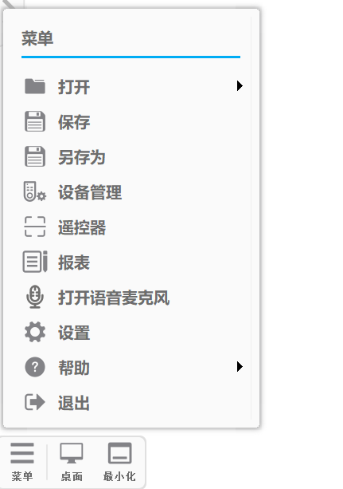

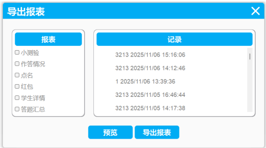

### 4.3 课堂端信息架构

课堂端保留原有授课主界面四区结构：**菜单栏、桌面（悬浮球/模块入口）、互动工具栏、页面工具栏**。

- 菜单栏：打开课件、退出课堂及当前阶段允许的课堂相关入口
- 桌面：悬浮球可拖动、收起/展开，显示课堂高频工具
- 互动工具栏：书写、橡皮、文本、词典、答题（选择、表达）、点读/评测、测验、AI 问答、计时器
- 页面工具栏：添加页、上页、页面、下页

课堂端主界面参考：

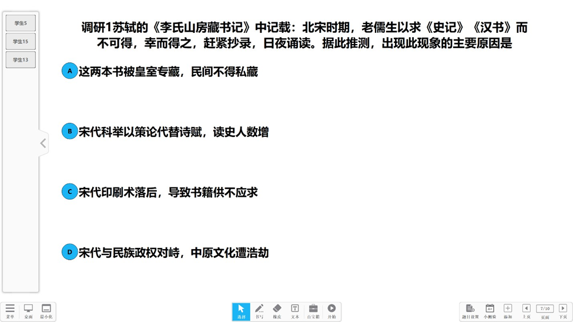

悬浮球参考：

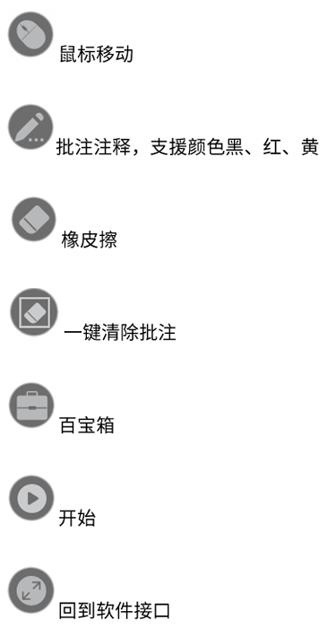

### 4.4 关键页面清单与截图映射

| 页面 | 工作区 | 参考截图 | 页面说明 |
| --- | --- | --- | --- |
| 登录页 | 登录前 | `image1.png` | 账号登录、记住密码、权限校验入口 |
| 教师管理端导航/首页 | 教师管理端 | `image3.png` | 承载班级、设备、报表、素材等管理模块入口 |
| 报表中心 | 教师管理端 | `image8.png` | 左侧报表类型、中部记录列表、底部预览/导出动作 |
| 课堂主界面 | 课堂端 | `image2.png` | 菜单栏 + 悬浮球 + 互动工具栏 + 页面工具栏四区结构 |
| 选择题作答视图 | 课堂端 | `image25.jpeg` | 题目展示、学生作答状态、课堂控制入口 |
| 选择题统计视图 | 课堂端 | `image26.jpeg`、`image28.png` | 选项分布、即时结果、统计图表与课堂讲评入口 |

### 4.5 关键页面文字线框

以下页面属于定制页面，需按指定结构实现；未特别列出的页面按行业通用交互实现，简单样式调整可配合修改，涉及结构/布局/交互逻辑的调整按需求变更处理。

**（1）教师管理端首页 / 导航**

- 页面目标：承载课前准备、课后复盘和资源管理
- 核心区域：顶部工作区切换区、左侧导航、右侧内容区
- 主要入口：班级与学生初始化、教室管理、设备管理、报表中心、资源/素材管理、个人设置、进入课堂
- 状态切换：未进入课堂时可自由切换模块；进入课堂后从顶部入口切到课堂端

**（2）班级管理页**

- 页面目标：完成班级基础数据维护、学生账号创建或导入、班级与教师/教室关系维护
- 核心区域：筛选区、班级列表区、学生明细区、学生初始化区、关系维护区
- 关键交互：按年级/学科/班级搜索，手动创建学生或 Excel 导入学生，关联一位或多位教师，绑定一个或多个教室，查看失败原因，进入课堂

**（3）教室管理页**

- 页面目标：完成同校范围内教室查看、创建、进入、离开和归档
- 核心区域：教室列表区、关联班级区、状态展示区、动作区
- 关键交互：查看教室关联班级、查看关联教师状态、进入/离开教室、按条件归档教室

**（4）设备管理页**

- 页面目标：课前检查设备在线状态和绑定关系
- 核心区域：状态筛选区、设备列表区、学生绑定区、批量操作区
- 关键交互：刷新、解绑、休眠、异常提示、进入课堂前确认设备可用

**（5）报表中心**

- 页面目标：按课次或学生回看课堂结果并导出
- 核心区域：左侧报表类型、中部记录列表、右侧或下方预览区、底部导出按钮
- 关键交互：按课次/日期范围/学生/模块筛选，预览与导出同源，导出仅支持 Excel

**（6）课堂主界面**

- 页面目标：保证授课、翻页、互动和讲评不中断
- 核心区域：课件展示区、悬浮球、互动工具栏、页面工具栏、课堂状态区
- 关键交互：开始课堂、发起互动、翻页、最小化/恢复、结束课堂

**（7）选择题统计页 / 测验结果中心**

- 页面目标：课堂中即时反馈，课后可回看
- 核心区域：题目摘要、实时统计表、柱状图/饼图、学生名单、课堂讲评动作
- 关键交互：在课堂端实时刷新统计，在教师管理端进入报表中心回看同一结果快照

### 4.6 UI 实现原则

- 当前截图仅作为结构和功能参考，不构成最终视觉稿承诺。
- 已定义关键页面按上述页面结构执行；未定义特殊结构的页面按行业通用规范实现。
- 颜色、字体大小等简单样式调整可配合修改；结构、布局、交互逻辑变化需重新评估。
- 运营管理中台相关页面视觉方向采用明亮、轻快、教育场景友好的浅色主题，不使用过于艳丽或过于深沉的主色调。

---

## 5. 角色权限

> 说明：教师端权限按“角色权限 + 学科/能力开关 + 数据范围”三层控制，并细化到工作区与动作级别。

### 5.1 权限原则

1. **最小权限**：默认仅开放完成当前角色工作所需的最小动作集合。
2. **工作区隔离**：课堂端不承担账号授权、全局配置、学校级数据维护；教师管理端不承担课堂实时互动主链路。
3. **学科差异**：不同学科可控制模块可见性与能力开关（如英语开放语音评测，语文开放笔画/朗读增强）。
4. **数据范围控制**：教师仅可访问同校范围内的教学准备数据，以及本人创建或被授权的班级、课次、学生与报表数据。
5. **高风险动作受控**：导出、删除、批量处理、配置类动作需额外授权并留痕。

### 5.2 操作级权限矩阵

| 角色 | 工作区 | 模块 | 查看 | 创建/发起 | 编辑/处理 | 删除/结束 | 导出/配置 | 数据范围 / 备注 |
| --- | --- | --- | --- | --- | --- | --- | --- | --- |
| 管理员 | 运营管理中台 | 账号授权 / 学校级配置 / 审计 | ✓ | ✓ | ✓ | ✓ | ✓ | 全局范围 |
| 教师 | 教师管理端 | 班级与学生初始化 | ✓ | ✓ | ✓ | ✓（按授权） | Excel 导入/导出 | 同校范围内教学准备数据 |
| 教师 | 教师管理端 | 教室管理 | ✓ | 创建/进入/离开 | 编辑关联关系 | 归档（按规则） | - | 同校范围内教室 |
| 教师 | 教师管理端 | 设备管理 | ✓ | - | 解绑/刷新/休眠 | - | - | 仅本人当前可见班级 / 教室 |
| 教师 | 教师管理端 | 报表中心 | ✓ | - | 预览/筛选 | - | Excel 导出 | 仅本人或授权课次 |
| 教师 | 教师管理端 | 资源 / 素材管理 | ✓ | ✓ | ✓ | ✓（按授权） | Excel 明细导出 / 音频导出 | 仅本人资源 |
| 教师 | 教师管理端 | 个人设置 | ✓ | - | 维护本人教师资料 | - | - | 仅本人数据 |
| 教师 | 课堂端 | 课次 / 课件 | ✓ | 进入课堂 / 打开课件 | 翻页 / 切换页面 | 结束课堂 | - | 仅本人当前课次 |
| 教师 | 课堂端 | 互动工具栏 / 测验 / AI 问答 | ✓ | ✓ | 讲评 / 回看 / 追问 | 结束题目 / 结束测验 | - | 受学科开关控制 |
| 学生 | 学生作答链路 | 选择作答 / 语音录音 / 跟读评测 | 查看本人提交状态 | 提交作答 | 重录 / 重提（按规则） | - | - | 仅本人数据 |

### 5.3 双工作区隔离规则

- 课堂进行中，教师管理端入口默认锁定，不允许在授课过程中进入班级 CRUD、设备批量维护、资源批量处理等管理动作。
- 教师管理端可发起“进入课堂”，但不直接承担课堂实时统计刷新和发题控制。
- 运营管理中台不进入课堂授课工作区；其权限不通过教师端界面直接暴露。

---

## 6. 功能需求（模块级）

> 结构说明：每个模块按【功能概述 → 业务规则 → 交互与页面 → 数据与导出 → 异常与提示 → 验收标准】描述。

---

# 6.1 登录管理模块

## 6.1.1 功能概述

- 支持账号密码登录验证
- 基于学科权限分配相应教学模块
- 支持记住密码和自动登录
- 支持密码重置：手机号或邮箱验证

登录界面示例：

## 6.1.2 页面与交互

### （1）登录界面元素

- 账号输入框
- 密码输入框
- 登录按钮
- 忘记密码链接

### （2）记住密码/自动登录

- **记住密码**：勾选后在本机保存加密凭据（具体加密方式实现确认）
- **自动登录**：勾选后下次启动自动尝试登录；失败时回到登录页并提示原因

## 6.1.3 账号授权与权限

- 管理员可对教师与学生账号进行账号授权
- 教师端权限按学科划分：语文、数学、英语、物理、化学、生物、地理、历史、政治等主要学科
- 登录成功后：仅展示该学科可用的教学工具模块（见桌面/互动工具栏）

## 6.1.4 业务规则

- 密码错误连续 N 次触发锁定（N、锁定时长可配置，默认建议：5 次/30 分钟，TBD）
- 同账号多端登录策略（允许/踢下线/提示冲突，TBD）

## 6.1.5 异常与提示

- 账号密码错误
- 账号被锁定
- 网络异常
- 其他失败场景提示（统一错误码与用户提示文案，TBD）

## 6.1.6 验收标准（示例）

- 输入正确账号密码可成功登录并进入主界面
- 勾选自动登录后重启软件可自动进入主界面
- 密码错误提示清晰且不泄露敏感信息（不提示“账号存在/不存在”差异，TBD）
- 忘记密码可通过手机号/邮箱完成验证并重置成功

---

# 6.2 软件主接口（主框架）

## 6.2.1 功能概述

主界面由四部分组成：菜单栏、桌面（悬浮球/模块入口）、互动工具栏、页面工具栏，用于承载授课中的所有操作入口与快捷互动。

主界面示例见 4.1。

## 6.2.2 关键交互规则（建议）

- 顶层操作优先级：**课堂互动 > 课件展示 > 数据查看导出**
- 课堂中弹窗尽量**非阻塞**（不遮挡课件关键区域）
- 所有“会改变课堂状态”的操作（解绑、清空、结束测验）需二次确认（TBD）
- 课堂中断（网络/设备）需可恢复：保留课次上下文与已收集数据（TBD）

---

# 6.3 菜单栏模块

## 6.3.1 打开（课件/素材）

### 功能概述

支持打开 PPT、QVF、图片、视频、Word、Excel 等多种形式的课件模板。

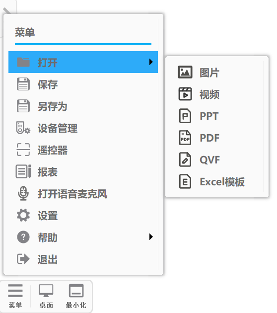

### 业务规则（建议）

- 支持拖拽打开（TBD）
- 最近打开记录（TBD）
- 打开失败提示：文件不存在/格式不支持/权限不足/文件损坏

### 验收标准

- 可成功打开至少：PPT、图片、视频、Word、Excel
- 打开后课件显示正常，互动工具可在课件上叠加批注

---

## 6.3.2 班级、学生与教室初始化

### （1）功能概述

- 班级信息管理（新增、删除、修改）
- 学生账号管理（导入、新增、删除、修改）
- 教室管理（查看、创建、进入、离开、归档）
- 班级数据统计与导出

> 使用前置：教师首次使用需创建班级/教室并创建或导入学生账号；后续上课仅需登录后选择教室和班级进入，系统自动同步班级信息并建立课堂互动关系。

模板示例：

**模板一：** 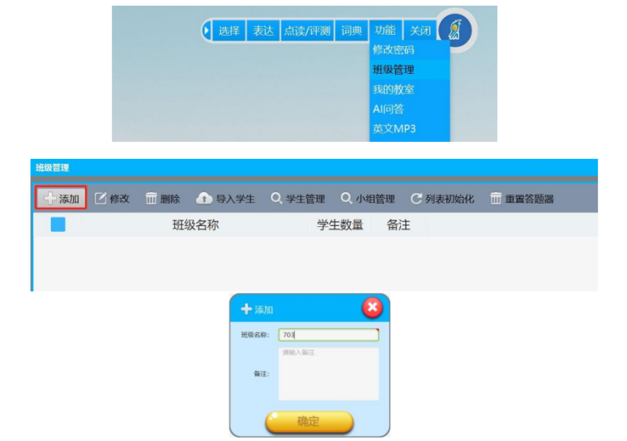

**模板二：** 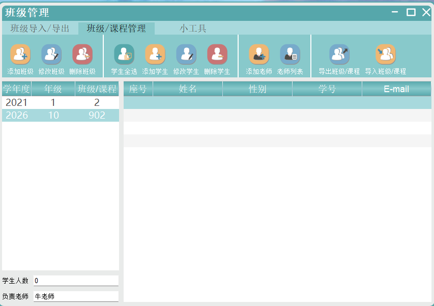

### （2）功能细则

1. 班级信息设置：班级名称、年级、学科、任课教师列表、关联教室列表、创建时间
2. 学生信息字段：姓名、性别、学号
3. 学生账号初始化：支持手动创建与 Excel 模板导入
4. 班级列表展示：支持按年级、学科筛选，支持搜索
5. 教室管理：支持查看同校教室、创建教室、进入/离开教室、查看关联班级与关联教师状态
6. 学生信息批量操作：批量删除、批量导出
7. 数据导出格式：Excel

### （3）业务规则

- 导入时校验：学号重复、空姓名、非法字符；支持导入结果报告（成功/失败行）
- 同一班级可关联一位或多位教师
- 一个教室可关联多个班级，进入课堂时需明确当前班级
- 同校教师可查看、创建、进入、离开教室，并维护班级与教室关系
- 教室删除按归档处理，仅当教室未关联教师时允许执行
- 教师端仅维护本人教师资料，不创建其他教师账号，不配置教师权限
- 删除班级：如存在历史课次数据，需二次确认，并提示“删除班级不删除历史报表/是否同时删除”（TBD）

### （4）验收标准

- 可创建/编辑/删除班级并在列表中正确显示
- 可为同一班级关联多位教师，并正确回显关联结果
- 可创建或导入学生账号并识别失败原因
- 可查看同校教室、创建教室、绑定多个班级，并按规则归档教室
- 可按年级/学科筛选，搜索可命中班级名称/班主任（TBD）
- Excel 导入可正确生成学生列表，导入错误可被识别并提示
- 批量导出文件字段与顺序符合模板定义

---

## 6.3.3 设备管理

### 功能概述

显示已连接/未连接的答题器设备列表，并支持连接状态管理、学生机登录状态管理与异常修复操作。

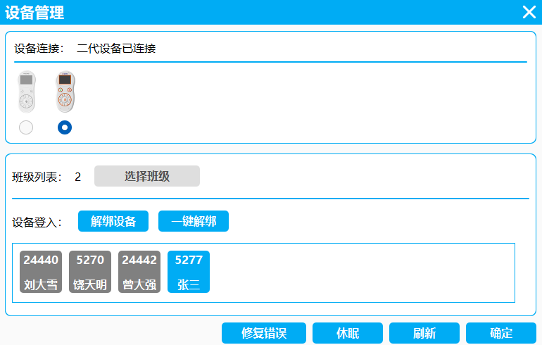

### 页面说明（来自原始需求）

- **设备连接**：主机连接状态、设备型号；亮起代表当前连接设备
- **设备登入**：当前班级学生名单；蓝色代表已连接学生机，灰色代表未连接
- **设备解绑**：登录学生退出
- **修复错误**：连接异常时使用（免驱主机无需）
- **休眠**：手动休眠所有答题器
- **刷新**：刷新名单查看连接状态更新（解绑后需刷新）
- **确定**：保存设备管理操作

### 业务规则（建议）

- 设备连接上限（TBD，例如 60 台/班）
- 连接超时：超过 T 秒未响应标记为“未连接”（TBD）
- 解绑后：该学生机状态应变为未连接，并在刷新后同步
- 修复错误：建议明确为“重连/重新配对/重启服务”等可见动作（TBD）

### 异常与提示（建议）

- 未检测到接收器/主机
- 部分学生机离线（列出离线名单）
- 连接不稳定（提示“建议刷新/修复/检查距离/电量”）

### 验收标准

- 能正确显示已连接与未连接设备及学生对应关系
- 解绑/休眠/刷新/确定可生效且状态一致
- 连接异常时能给出明确提示并提供可操作的恢复入口

---

## 6.3.4 报表导出

### 功能概述

- 每一次作答自动生成报表：作答情况、测验、学生详情、答题汇总
- 所有选择、语音、文字记录自动保存，支持查询和导出

### 操作流程

1. 在右侧记录中选择对应时间（课次/互动记录）
2. 勾选需要导出的报表类别
3. 点击“预览”或“导出报表”

### 报表类型与关键字段

| 报表类型 | 内容概述 | 关键字段 |
| --- | --- | --- |
| 作答情况 | 单次互动题统计 | 课次 ID、题目 ID、题型、题干摘要、正确答案、应到人数、实际作答人数、参与率、正确人数、正确率（按应到）、正确率（按实答）、未作答人数、缺席人数、选项分布、开始时间、结束时间、用时 |
| 测验报告 | 一套试卷 / 测验结果 | 课次 ID、测验 ID、试卷名、题数、总分、学生得分、班级均分、最高分、最低分、分数分布、提交时间 |
| 学生详情 | 某学生的作答与语音记录 | 学生 ID、学生姓名、班级、课次、题目列表、答案、得分、录音链接、转写文本、评分等级、参与率 |
| 课次汇总 | 课次 / 时间段汇总 | 课次 ID、班级、教师、互动数、测验数、应到人数、实际作答人数、参与率、平均正确率（按应到）、平均正确率（按实答）、语音记录数、问题汇总 |

### 图表与统计展示要求

- 作答情况默认提供统计表、柱状图和正确率饼图。
- 图表展示维度固定为：按题目、按学生、按课次。
- 图表字段与导出字段同源，课堂端实时图表和教师管理端报表中心回看使用同一统计口径。
- 排序规则默认按提交时间、成绩或错误率降序；如无明确要求，按记录时间倒序展示。

### 导出规则

- 正式导出格式仅支持 `Excel`
- 导出命名：`{班级}_{课次日期}_{报表类型}.xlsx`
- 支持筛选：按课次、按日期范围、按学生、按模块
- 导出权限：默认仅教师本人课次；管理员通过运营管理中台可查看全局
- 预览与导出必须同源；记录筛选条件、导出时间和导出人
- `CSV / PDF / 水印` 不作为当前默认承诺，若后续单独立项再评估

### 验收标准

- 任意一次互动后可在记录中检索到对应报表条目
- 预览数据与导出数据一致
- 导出文件字段齐全，导出内容中的文本字段统一按 UTF-8 编码规范处理

---

## 6.3.5 语音 MP3（TTS）

### 功能概述

- 文本转语音 MP3 生成，多语言支持
- 音频管理与导出

入口界面示例：

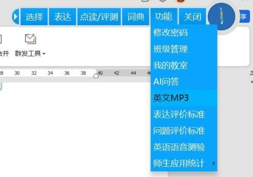

### 详细需求

#### ① 文本输入

- 支持直接输入文本
- 支持复制粘贴
- 支持导入文档：TXT、Word

#### ② 语音生成

- 语言支持：中文、英文
- 语音风格：标准普通话、美式英语、英式英语
- 支持语速、音量、音调调节

#### ③ 音频管理

- 在线播放：生成后可立即播放预览
- 音频保存：支持 MP3 格式保存
- 文件导出：支持单个或批量导出

### 交互流程（示例）

1. 点击“添加”，输入文章名称与内容并保存：

2. 需要生成对话时，选择“是否对话=是”，内容用回车换行切换男女声：

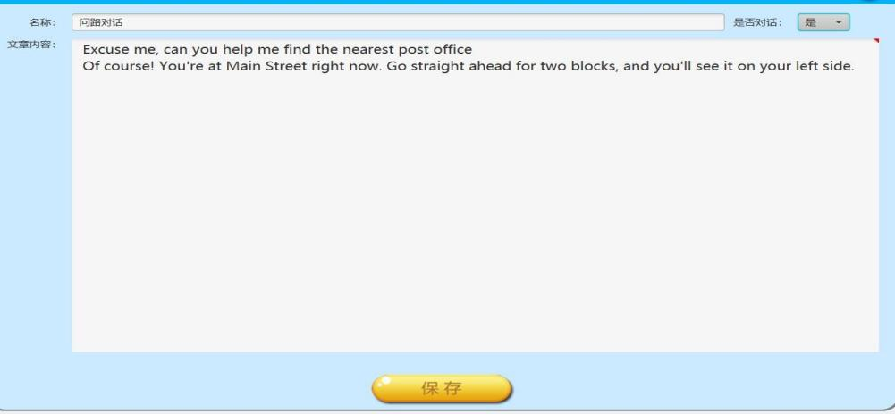

3. 勾选文章 → 选择男/女声语音库 → 设置语速 → 点击“生成 MP3”导出：

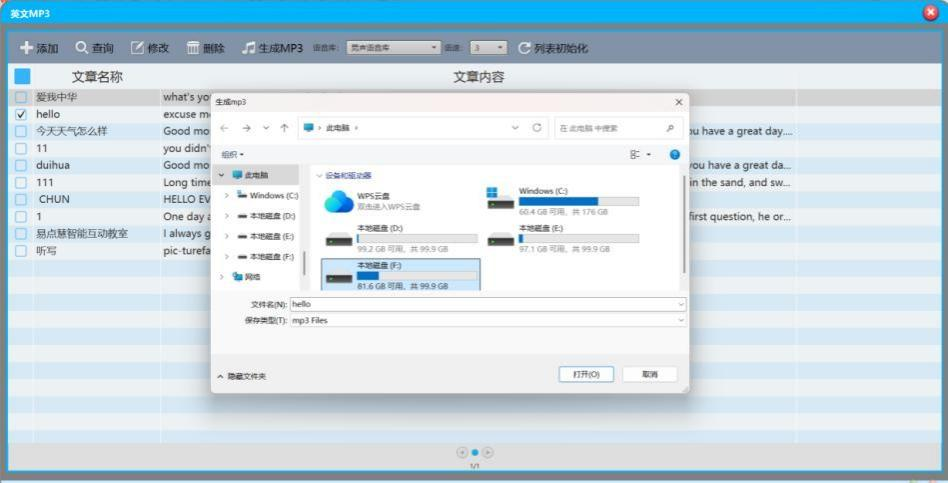

### 业务规则（建议）

- 文章内容不少于 1 个字符（已有要求）
- 导出位置默认：用户选择的本地目录；记忆上次路径（TBD）
- 生成失败提示：网络异常/服务异常/文本过长（TBD，需定义上限）

### 验收标准

- 输入任意短文本可成功生成 MP3 并本地保存
- “对话模式”可按换行实现男女声交替输出
- 批量导出可成功导出多条音频且文件命名不冲突

---

## 6.3.6 退出

- 退出软件（如课堂进行中，建议提示“是否结束课次并保存数据”，TBD）

---

# 6.4 桌面（悬浮球/模块入口）

## 6.4.1 功能概述

- 桌面浮动图示状态（悬浮球）
- 显示所有功能模块图标（可自定义排列）
- 支持同时打开其他软件/课件，互不影响
- 支持图标大小调整、隐藏不需要的模块

模板一见 4.3。

## 6.4.2 交互规则（建议）

- 悬浮球拖动：不影响课件操作；靠边吸附（TBD）
- 收起/展开：单击切换（以实际实现为准）
- 模块排序：拖拽调整（TBD）
- “课堂中”状态提示：例如红点/课次计时（TBD）

## 6.4.3 最小化（占位补齐建议）

> 原始材料为占位。建议明确：最小化后悬浮球是否保留、是否隐藏工具栏、快捷键是什么、恢复时回到哪个页面（TBD）。

---

# 6.5 互动工具栏

> 互动工具栏是课堂互动核心入口，所有互动均需关联到“课次/班级/学生/题目/时间”。

---

## 6.5.1 书写（批注）

### 功能概述

- 画板批注
- 支持设置字体粗细、颜色

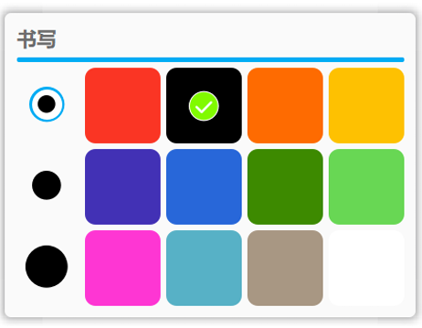

### 业务规则（建议）

- 支持撤销/重做（TBD）
- 批注是否随页面保存、是否导出到报表/课件（TBD）

### 验收标准

- 可在课件上书写并切换颜色、粗细
- 切换页面后批注按规则保留/清空（以配置为准）

---

## 6.5.2 橡皮

### 功能概述

- 像素擦（可选择擦除范围）
- 清空（删除画板所有对象）

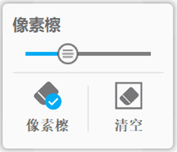

### 验收标准

- 像素擦可擦除指定区域批注
- 清空可一键删除本页全部批注并有二次确认（TBD）

---

## 6.5.3 文本

### 功能概述

- 文本工具
- 支持自定义字体和大小等

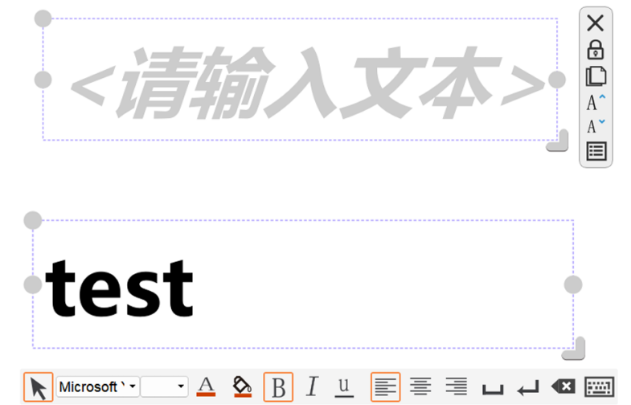

### 验收标准

- 可在页面插入文本框并设置字体/字号
- 文本位置可拖拽调整（TBD）

---

## 6.5.4 词典

### 功能概述

- 多语言词典查询
- 学科专业词汇
- 支持丰富词汇信息展示
- 支持离线词典包下载（离线查询）

实时查询示例（框选弹出释义）：

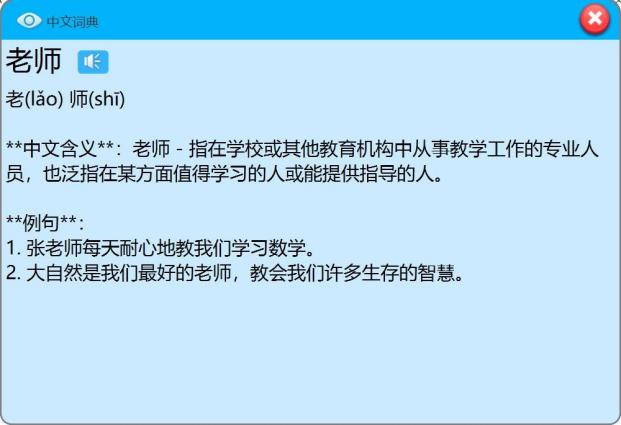

语文笔画功能示例：

### 详细需求

#### ① 查询功能

- 实时查询：输入或选中文本自动显示词典结果
- 支持拼音、首字母、英文拼写查询

#### ② 词汇信息

- 中文：拼音、词性、名词解释、近义词、反义词
- 英文：音标、词性、中文释义、例句、搭配
- 专业术语：学科分类、详细解释、应用场景

#### ③ 学科定制

- 语文：单字笔画顺序动画、汉字结构分析、造句
- 数学：公式解释、定理说明、例题演示
- 其他学科：可配置专业词汇库

#### ④ 离线功能

- 支持下载词典数据包，实现离线查询

### 业务规则（建议）

- 框选触发：支持单词/短语/句子；超过长度上限提示（TBD）
- 离线包：版本管理与更新提醒（TBD）

### 验收标准

- 框选文本后可弹出释义窗口且信息完整
- 在离线模式下仍可完成词典查询（已下载词库）

---

## 6.5.5 答题（选择、表达）

---

### 6.5.5.1 选择题互动

#### 功能概述

- 多种题型支持（判断、单选、多选）
- 答题模式设置（单人、抢答、全选）
- 答题结果统计与分析（表格、柱状图、饼图等）
- 支持 AI 辅助分析（薄弱点建议、错题整理）

选择题界面示例：

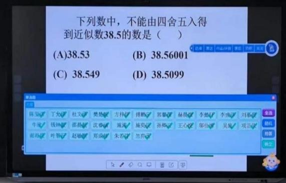

统计示例：

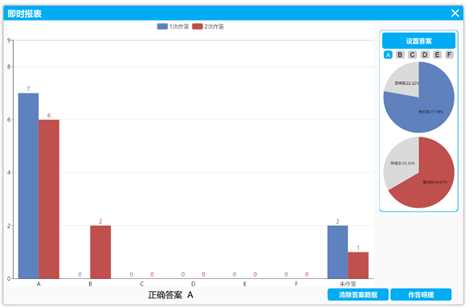

#### 详细需求

**① 题型支持**

- 判断题：正确/错误
- 单选题：1 个正确答案
- 多选题：多个正确答案

**② 答题模式**

- 单人模式：指定单个学生答题
- 抢答模式：所有学生可抢答；支持设置抢答人数；显示抢答成功学生
- 全选模式：全班作答（建议补充说明：是否可重复提交、截止时间等，TBD）

**③ 结果统计**

- 正确率、错误率
- 每个选项的选择人数及比例
- 图表：统计表格、柱状图、正确率饼图
- 统计维度：按学生/按题目；支持在线查看和导出

**④ AI 辅助分析（可选/需开关）**

- 识别知识薄弱点并给出教学建议（需明确依据：错因/知识点标签，TBD）
- 错题自动整理（需定义“错题本”结构与导出格式，TBD）

#### 业务规则（建议）

- 作答窗口：开始/截止时间、是否允许修改答案
- 未作答统计口径：统一区分“未作答人数”和“缺席人数”，并同步展示正确率（按应到）与正确率（按实答）
- 抢答：同一时间多台提交冲突的判定规则（TBD）

#### 验收标准

- 可创建判断/单选/多选并成功发起课堂互动
- 学生提交后教师端实时更新统计
- 可生成并导出题目统计报表（字段与口径一致）

---

### 6.5.5.2 表达题（语音表达）

#### 功能概述

- 语音答题录制与播放
- 语音转文字（中/英），准确率目标 ≥ 95%（需定义测试条件）
- AI 自动评分
- 教师追问互动
- 记录自动保存与导出

表达题答题与回放示例：

AI 表达评测示例：

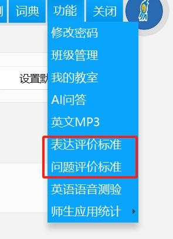

教师追问示例：

#### 详细需求

**① 语音处理**

- 学生按住话筒键持续按压直至结束（类似微信语音操作），中途不得松开
- 支持原声播放，可调节音量、播放速度（TBD）
- 语音转文字：中文/英文实时转换
- 文字编辑：允许教师修正转换错误

**② AI 评分**

- 评分标准可配置：发音准确性、流畅度、内容完整性
- 评分等级：优秀/良好/中等/及格/不及格
- 展示评分依据与改进建议
- 可按评分排序（原始需求提到排序功能）

**③ 互动功能**

- 教师基于学生回答继续提问
- 支持学生补充回答

**④ 记录保存**

- 语音与文字记录自动保存，支持查询与导出

#### 异常与提示（建议）

- 录音失败（麦克风权限/设备离线）
- 转写失败（网络/服务）
- AI 评分失败（降级为“仅保存录音+转写”）

#### 验收标准

- 学生可通过课堂录音方式完成作答，教师端可播放录音
- 教师端可查看转写文本并进行编辑保存
- AI 评分可返回等级与建议，并可对学生答案排序（如开关开启）

---

## 6.5.6 点读/评测

### 功能概述

- 文本点读（单词、句子、段落）
- 跟读对比
- 翻译
- 测评（打星/评分）

教师框选内容选择男/女声朗读示例：

评测流程示例：

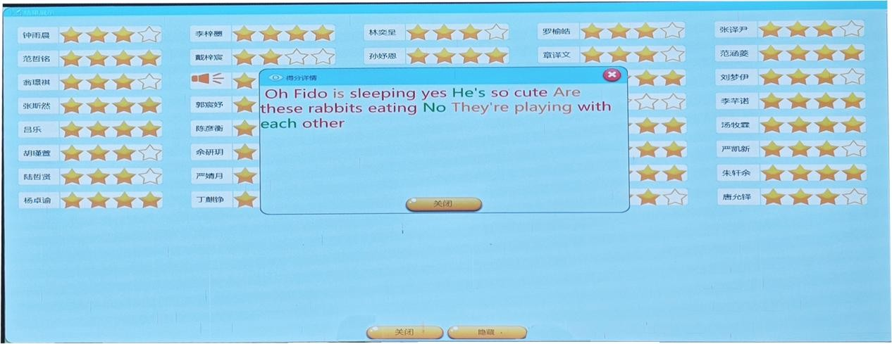

### 详细需求

**① 点读**

- 支持划线/框选文本（单词/句子/段落）
- 朗读：标准发音，可调语速、音量
- 跟读：学生录音，与标准发音对比

**② 翻译**

- 支持中英互译，准确率目标 ≥ 90%（需定义测试条件）
- 提供多种翻译结果与例句（TBD：展示样式）

**③ 测评**

- 基于点读内容生成测评题目
- 支持发音测评、理解测评（TBD：理解测评题型）
- 即时反馈结果（打星/分数）

**④ 学科适配**

- 语文：汉字读音、解释、造句
- 英语：单词发音、词性、用法
- 其他学科：专业术语解释

### 验收标准

- 框选文本后可完成“朗读/跟读/评测”完整流程
- 评测结果可按学生展示并支持导出（数据字段明确）

---

## 6.5.7 测验

### 6.5.7.1 语音测验（英语为主）

#### 功能概述

- 口语人机对话测评
- 试卷导入与管理
- 自动评分与报告生成

模板示例：

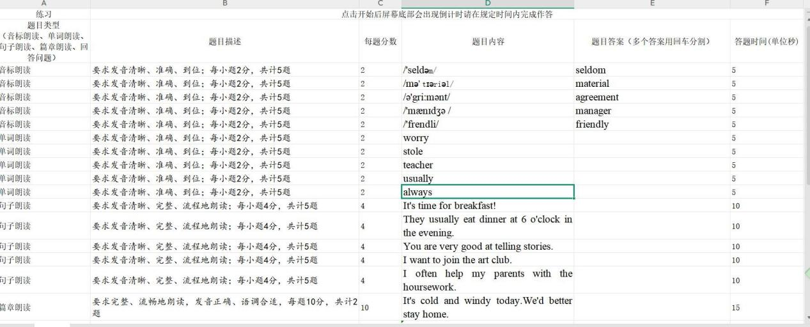

导入试卷示例：

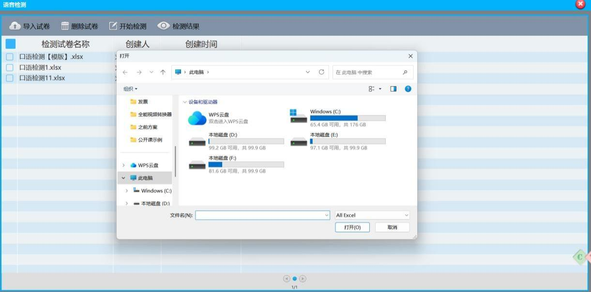

开始检测示例：

报告示例：

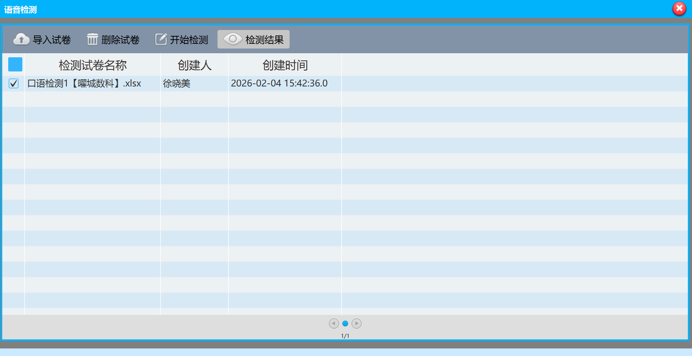

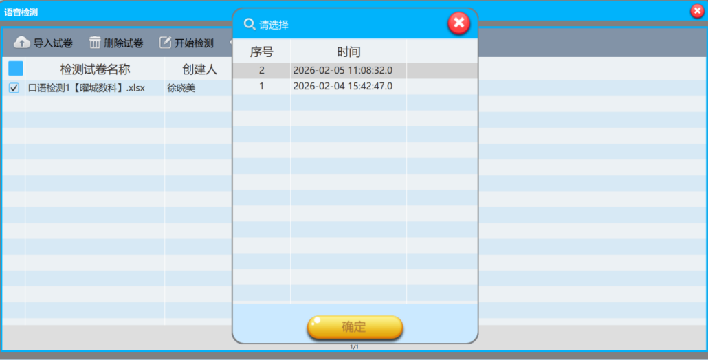

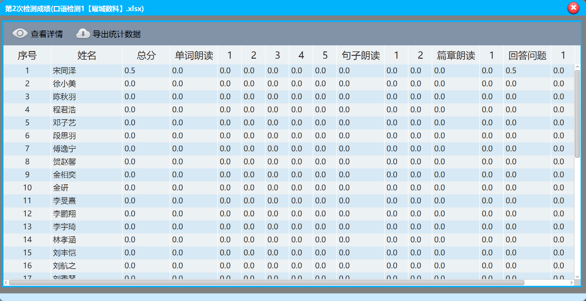

#### 详细需求

**① 试卷管理**

- 试卷导入：支持按模板导入
- 模板字段：题目类型、题目描述、题目内容、题目分值、答题时间限制
- 分类：按年级、学科、难度分类（TBD：分类规则）

**② 测评流程**

- 开始测试：显示要求，倒计时开始
- 语音答题：学生语音回答，系统录音
- 结束：自动提交或手动提交（TBD：超时策略）

**③ AI 评分**

- 维度：发音准确性、流畅度、内容相关性、语法正确性
- 权重可配置
- 输出：总分、各维度得分、详细评语

**④ 测评报告**

- 个人报告：录音、转录、评分详情、改进建议
- 班级报告：平均分、分布、共性问题分析

#### 验收标准

- 试卷模板导入后可在列表中展示并可发起测验
- 测验过程中倒计时准确，超时策略符合设定
- 生成个人/班级报告且可导出（导出格式与字段明确）

---

### 6.5.7.2 题目测试模块（类似语音测试）

#### 功能概述

- 随堂测验创建与管理
- 多题型支持
- 自动批改与结果分析

#### 详细需求

**① 测验创建**

- 支持单种或混合题型
- 题型：选择、判断、口头填空、口头简答
- 支持按模板导入题目

**② 模板规范**

- 基础字段：题目类型、题目内容、题目选项、题目答案、题目分值
- 扩展字段：难度、知识点、答题时间

**③ 测验执行**

- 答题方式：答题器、语音、触屏（TBD：触屏设备形态）
- 实时反馈：进度、剩余时间
- 防作弊：随机题目顺序、选项顺序

**④ 结果处理**

- 自动批改：客观题自动评分；主观题辅助评分（TBD：辅助方式）
- 成绩统计：个人成绩、班级排名、正确率分析
- 数据导出：成绩表、答题详情表

#### 验收标准

- 模板导入后可生成测验并下发
- 客观题评分正确；导出成绩表字段完整
- 随机顺序生效且可配置开关（TBD）

---

## 6.5.8 AI 问答

### 功能概述

点击“AI 问答”进入举手提问界面：自动识别学生语音（中英文），AI 回复并对问题归纳总结；老师可点选合适问题后触发“AI 回答”。

界面示例：

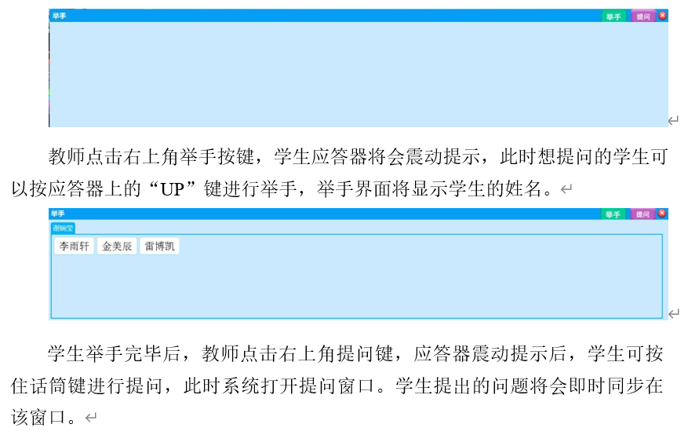

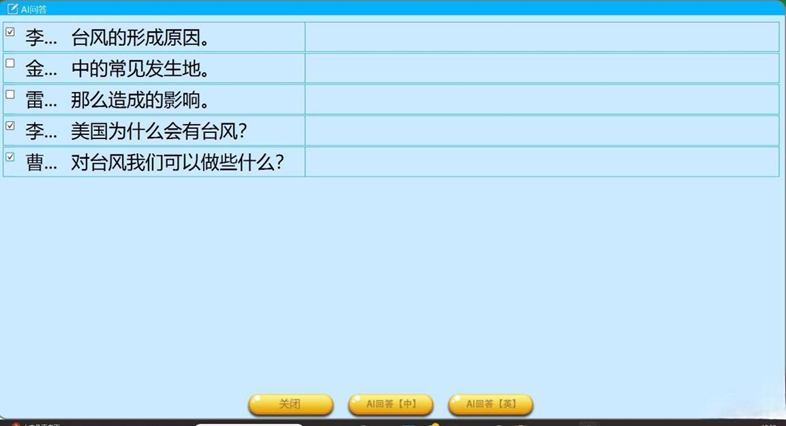

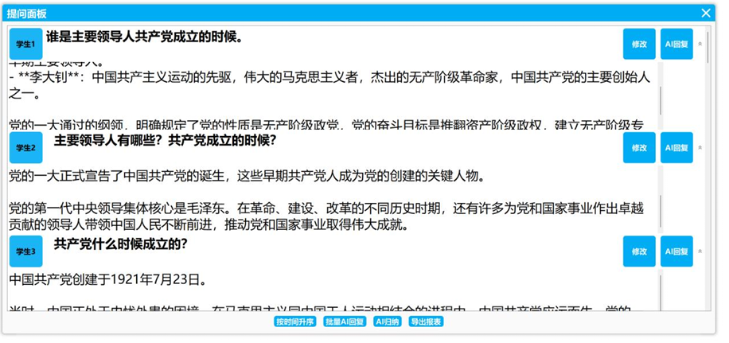

教师点选问题后点击“AI 回答”示例：

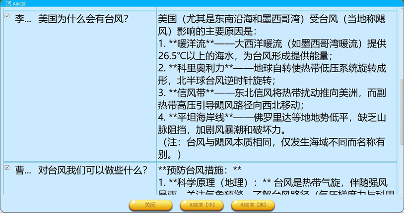

### 业务规则（建议）

- 语音识别失败：提示重说/改为文字输入（TBD）
- AI 回答合规：敏感内容过滤/提示免责声明（TBD）
- 课堂总结：按课次保存，可导出为文本/图片（TBD）

### 验收标准

- 学生提问语音可被识别并生成问题列表
- 教师选择问题后 AI 可生成回答并展示
- 本节课问题可自动汇总并保存为课次记录的一部分

---

## 6.5.9 计时器

### 功能概述

- 设定时间，点击确定后悬浮在页面右上方
- 倒计时结束后自动关闭

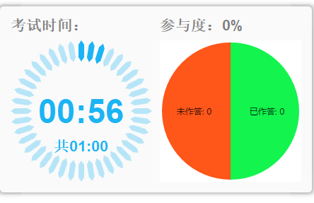

### 验收标准

- 可设置倒计时并悬浮显示，不遮挡关键区域（TBD：可拖拽）
- 结束后提示并自动关闭/可配置提醒音（TBD）

---

# 6.6 页面工具栏

## 6.6.1 添加

- 添加下一页空白页

## 6.6.2 上页

- 上翻一页

## 6.6.3 页面（预览）

- 点击页面调出页面预览图，方便快速查看
- 可点击指定页面
- 支持删除当前页面和添加

## 6.6.4 下页

- 下翻一页

### 验收标准

- 添加页后页码正确更新
- 页面预览可跳转到指定页
- 删除页有二次确认（TBD）且不会影响已保存的课堂记录（TBD）

---

## 7. 数据留存与导出（统一要求）

### 7.1 数据留存范围

- 互动记录：题目、答案、统计、时间
- 学生维度：参与率、正确率、语音评测结果
- 音频与转写：录音文件、转写文本、评分结果（如启用）
- AI 问答：问题、回答、课堂总结

### 7.2 查询维度（建议）

- 按课次时间
- 按班级/教室
- 按学生
- 按题型/模块（选择/表达/点读/测验/AI 问答）

### 7.3 统计口径字典

| 指标 | 定义 |
| --- | --- |
| 应到人数 | 当前课次中应参与本次互动或测验的学生人数，以课次绑定学生名单为准 |
| 实际作答人数 | 在当前互动或测验中成功提交结果的学生人数 |
| 参与率 | 实际作答人数 / 应到人数 |
| 正确率（按应到） | 正确人数 / 应到人数 |
| 正确率（按实答） | 正确人数 / 实际作答人数 |
| 未作答人数 | 已进入课次范围但未提交当前任务结果的人数 |
| 缺席人数 | 课次开始后未上线或被标记为未到课的人数 |

### 7.4 导出规范

- 统一导出字段字典、统计口径、时间格式、时区与编码
- 默认按 `UTF-8` 编码，日期时间字段统一到系统时区显示
- 导出文件命名遵循 `{班级}_{课次日期}_{报表类型}.xlsx`
- 仅支持 Excel 导出；非 Excel 形态作为扩展项单独评估
- 导出需校验角色权限、学科能力、数据范围
- 大数据量导出可采用异步任务，但导出结果必须与预览快照一致

---

## 8. 非功能需求

### 8.1 性能

- 课堂互动统计刷新延迟：≤ 1s（TBD）
- 支持课堂中稳定承载班级规模内的学生设备接入（TBD）
- 大班级导入：≥ X 条学生记录（TBD）

### 8.2 可靠性

- 网络波动下：数据不丢失；断线后可恢复课次（TBD）
- 本地崩溃保护：自动保存批注/课次状态（TBD）

### 8.3 兼容性

- 操作系统：Windows 10/11（TBD）
- 分辨率：1366×768 及以上（TBD）
- 外设：接收器/答题器型号清单（TBD）

### 8.4 安全

- 本地保存的“记住密码”需加密
- 报表导出需权限校验
- 账号锁定策略与审计日志（TBD）

---

## 9. 验收（建议）

### 9.1 验收方式

- 功能验收：按本 需求清单 验收标准逐条测试
- 数据验收：导出文件字段/口径对齐
- 场景验收：按“典型场景 A-D”走通

## 10. 风险与依赖（建议）

| 风险/依赖 | 说明 | 应对 |
| --- | --- | --- |
| 设备连接稳定性 | 课堂环境复杂，易受干扰 | 明确状态机/重连策略；增强提示与诊断 |
| AI/语音能力效果 | 受噪音/口音/麦克风影响 | 定义测试条件；提供降级方案（仅录音/仅转写） |
| 报表口径争议 | 正确率/缺考/抢答等口径差异 | 先对齐字段字典与口径说明 |
| 客户环境差异 | OS/权限/杀毒软件影响安装与驱动 | 提供兼容性清单与安装指引 |
